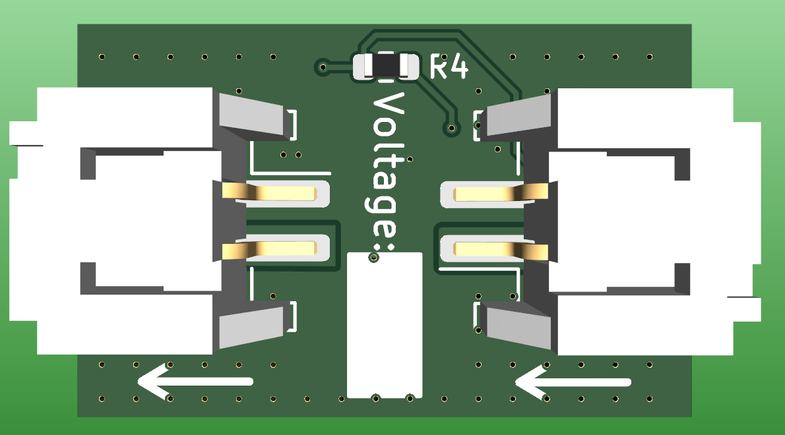

# The Vuwu inline voltage converter

This Project is a small adjustable Buck-Boost converter board, designed to be fitted inline with a Power Cable. It's only 14mmx22mm making it ideal for splicing in to a cable and wrapping it with heat shrink. The connectors used are *2 pin JST PH 2.0 SMD vertical*. A Link to them can be found [here](https://de.aliexpress.com/item/1005004938361514.html?spm=a2g0o.order_list.order_list_main.4.70475c5fH9vSV2&gatewayAdapt=glo2deu).

## Ordering

The design files for KiCad are located in the folders. Alternatively you can use the GERBER Files with a preconfigured BOM to order them from JLCPCB.

## Setting the Voltage

Due to the small size of the board, adding a potentiometer was not possible.
The output voltage can be set via the $R_4$ Resistor located on the back of the PCB. $R_4$ is calculated as follows:

$$R_4 = R_3 \cdot \left(\frac{V_{OUT}}{V_{REF}} - 1\right) = 10k\Omega \cdot \left(\frac{V_{OUT}}{0.8V} - 1\right)$$

Alternatively there is a small conversion table for common voltages:

|$V_{OUT}$|    $R_4$   |
| ------- | ---------- |
|  $3V3$  | $31k\Omega$|
|  $5V$   | $53k\Omega$|
|  $5V3$  | $56k\Omega$|
|  $5V5$  | $59k\Omega$|

**Important:** The [TPS63070](https://www.ti.com/lit/ds/symlink/tps63070.pdf?ts=1701570165058&ref_url=https%253A%252F%252Fwww.ti.com%252Fproduct%252Fde-de%252FTPS63070) only has a output Voltage Rage of $2.5V$ to $9V$ and an approximate max. current of $2A$. For more information, see the [datasheet](https://www.ti.com/lit/ds/symlink/tps63070.pdf?ts=1701570165058&ref_url=https%253A%252F%252Fwww.ti.com%252Fproduct%252Fde-de%252FTPS63070).

## Pictures

